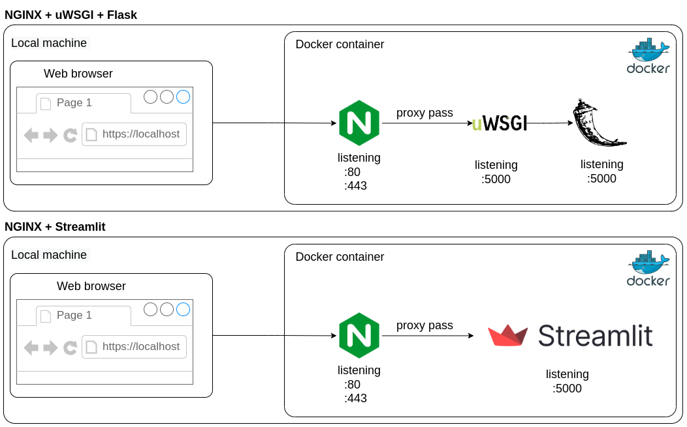

# Criação de um container Nginx com app em SSL

Neste projeto vamos configurar o **NGINX como um proxy reverso** para uma aplicação em python, podendo ser ela em **Flask** ou **Streamlit**.

Este é apenas um exemplo a fim de entendimento e não é um projeto produtivo.

## Arquitetura



## Entendendo o diretório

```text
.
├── app
│   ├── flask
│   │   ├── __init__.py
│   │   ├── main.py
│   │   └── wsgi.py
│   └── streamlit
│       └── streamlit.py
├── certs
│   ├── dhparam.pem
│   ├── nginx-selfsigned.crt
│   └── nginx-selfsigned.key
├── conf
│   └── nginx
│       ├── nginx.conf
│       └── snippets
│           ├── self-signed.conf
│           ├── serverLocations.conf
│           └── ssl-params.conf
├── Dockerfile
├── os-requirements.txt
├── README.md
├── requirements.txt
└── scripts
    ├── createcert.sh
    └── entrypoint.sh
```

Começando pela raiz, temos os arquivos Dockerfile (responsável pela receita de criação da imagem), os-requirements.txt (utilizado pelo Dockerfile para instalar os pacotes do sistema operacional) e requirements.txt (utilizado pelo Dockerfile para instalar pacotes python).

Na pasta `app` temos a aplicação a ser executada. Neste caso, temos uma aplicação em flask, seguindo o [Flask Hello World](#referências) e usando o [UWSGI](#referências) como *web server*.

A pasta `certs`contém os certificados utilizados pelo NGINX caso o usuário não queira gerar os certificados auto-assinados em tempo de *build*.

As configurações do NGINX estão na pasta `conf`.

Na pasta `scripts` temos códigos em `shell script` usados pelo Dockerfile.

## Utilização

Comandos básicos.

### Build

Necessário estar na raíz do diretório:

```bash
# Cria imagem com a tag minhaimagemnginx:latest.
docker build . --tag minhaimagemnginx
```

---

### Flask

```bash
# Inicia o uWSGI com o path app/flask usando a opção padrão de app (app).
docker run -p 443:443 -p 8080:80 --rm -it minhaimagemnginx flask

# Altera o app utilizado pelo uWSGI
docker run -p 443:443 -p 8080:80 --rm -it minhaimagemnginx flask meuprojeto
```

---

### Streamlit

```bash
# Utiliza a opção padrão (streamlit hello).
docker run -p 443:443 -p 8080:80 --rm -it minhaimagemnginx streamlit
```

```bash
# Utliza o arquivo dir/arquivo/streamlit.py para execução do servidor.
docker run -p 443:443 -p 8080:80 --rm -it minhaimagemnginx streamlit <caminho/arquivo/streamlit.py>

# Exemplo:
docker run -p 443:443 -p 8080:80 --rm -it minhaimagemnginx streamlit app/streamlit/streamlit.py
```

---

### Bash

```bash
# Executa o bash dentro do container.
docker run --rm -it minhaimagemnginx bash
```

#### Utils

``` bash
# Executa o entrypoint selecionando o servidor streamlit
/app/scripts/entrypoint.sh streamlit

# Executa manualmente o servidor streamlit hello e o NGINX.
nginx && streamlit hello --server.enableCORS true --server.port 5000

# Executa manualmente o servidor streamlit uWSGI e o NGINX.
nginx && uwsgi --pp app/ --socket 0.0.0.0:5000 --protocol=http -w wsgi:app
```

## Referências

- [Flask Hello World](https://pythonbasics.org/flask-tutorial-hello-world/)
- [UWSGI Docs](https://uwsgi-docs.readthedocs.io/en/latest/WSGIquickstart.html)
- [Nginx com SSL auto assinado](https://www.digitalocean.com/community/tutorials/how-to-create-a-self-signed-ssl-certificate-for-nginx-in-ubuntu-16-04)
- [Streamlit Nginx](https://github.com/Taxuspt/heroku_streamlit_nginx)
- [Nginx Docs](http://nginx.org/en/docs/)